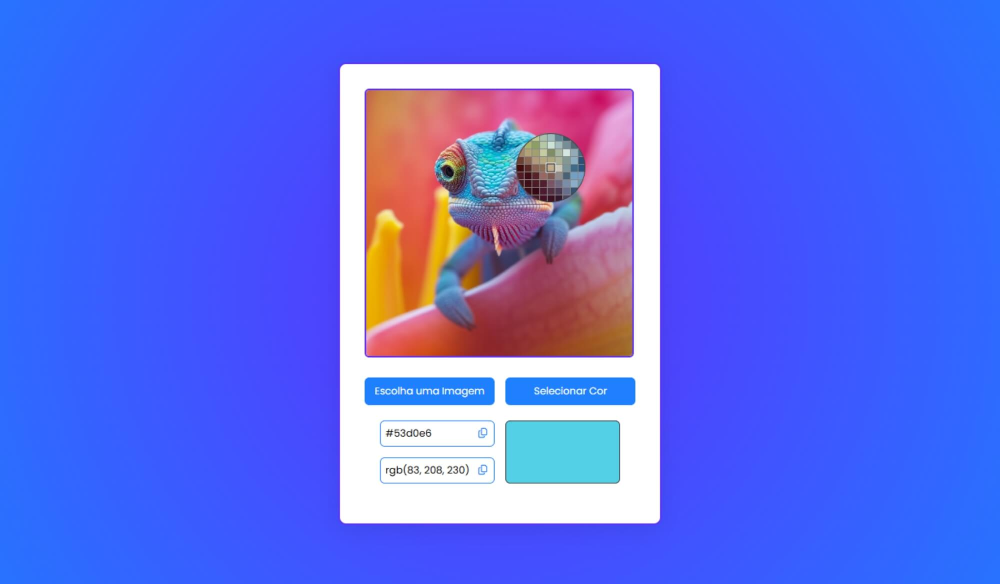

# App Color Picker

## Sobre o projeto

Um apicativo simples capaz de selecionar um pixel em uma imagem e obter seu código de cor utilizando o EyeDropper.

## Como utilizar

Clique na imagem para escolher uma cor.

Use o seletor de cores de imagem para selecionar uma cor e obter o código de cor RGB e HEX deste pixel. Clicando em 'Escolha uma imagem', você pode carregar sua própria imagem (por exemplo, uma captura de tela da sua área de trabalho).

## Informações

Projeto desenvolvido utilizando apenas HTML, CSS e JavaScript.

